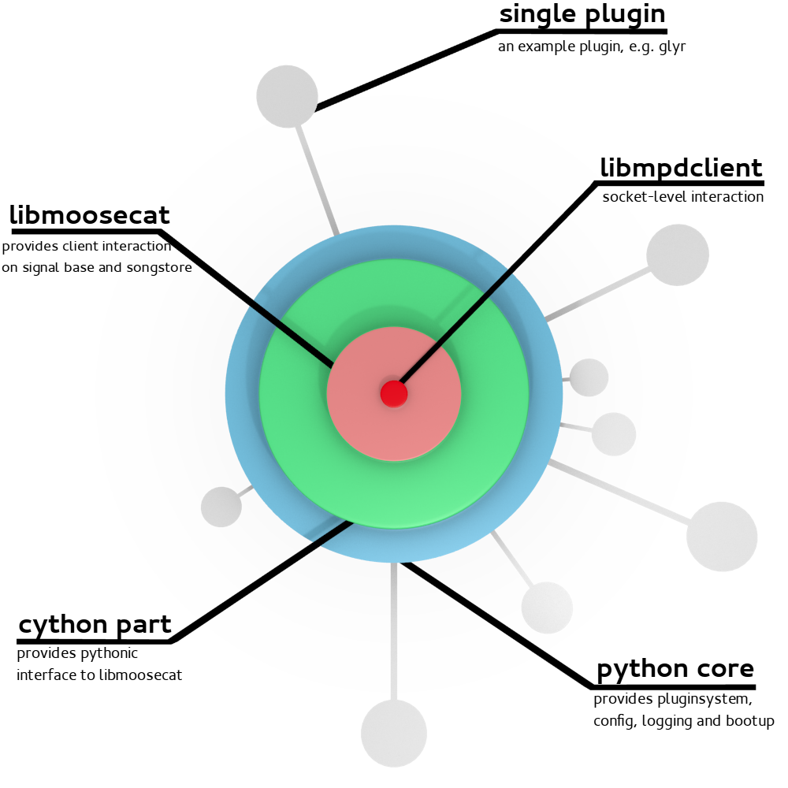

Architecture Overview
=====================

Moosecat is split in several layers. Each layer has it's own duty and you will 
most likely only use the most outer one.

Some description that should get you started: 

libmpdclient
------------

* Third party library used by many other clients. 
* Provides low-level socket communication to MPD and basic structures like
  ``mpd_song``, ``mpd_status``, ``mpd_output``...

libmoosecat
-----------

* Written in C99.
* Uses ``libmpdclient`` to talk to MPD.
* Offers two connection methods: 
    
    1) Use two connections, one for events and for commands.
    2) Use one connection, switch between modes with MPD's ``idle`` command.

* Implements a Songstore with SQLite that mirrors MPD's Database.
* Provides fast searching via SQLite's FullTextSearch Extension.
* Tries to minimize communication. (Longer startup time as tradeoff)
* Offers an easy to use API that could be used also in other projects.
* Provides signals to dispatch events.
* Event mechanism relies on Glib's mainloop, normal client can run without
  "manually driven".
* Wraps ``libmpdclients`` commands.

Cython part
-----------

* Wraps ``libmoosecat`` API in a pythonic manner.
* Code resides in ``moosecat/core/*.pyx``.
* Gets compiled to a single ``.c`` file, which is compiled in turn and linked to
  libmoosecat.
* Simple Usage Example: ::

    >>> import moosecat.core as m
    >>> client = m.Client()
    >>> if client.connect(host="localhost", port=6666):
    ...     client.player_next()
    ...     print(client.status)
    ... 
    >>> client.disconnect()

Python Core
-----------

* All layers below are written in a very generic way, that could be used by any
  MPD Client. This layer implements the first stuff being specific to moosecat.
* Provides things like ``config``, ``logging``, ``boot`` and most importantly
  the plugin system. It basically sets up all the things to get started for you.

Plugins
-------

...

Deployment
----------

Will be hard. ☺

Need yet to figure out what the best way will be.
